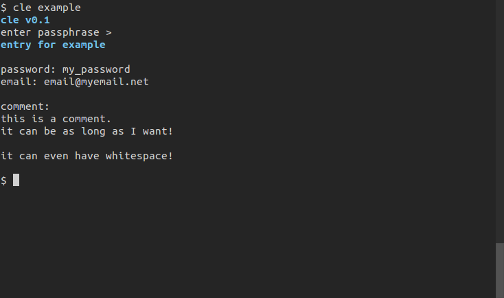

# cle
A CLI password manager for linux

cle running in gnome-terminal

# About

cle stores entries of passwords, emails, and a comment that are encypted with a master password. File names themselves are created by hashing the entry key with the master password 2048 times, meaning that without the master password you cannot even tell which entry a file corresponds to.

Although the purpose of the program is to store passwords behind one
master password, there is nothing stopping you from using as many
master passwords as you wish, the encryption of each entry is
completly seperate from the encryption of all others.

Encryption is AES256-cbc, done through openSSL. Files are salted with eight random bytes, and the salt is stored at the
start of encrypted files. Before encryption, a sixteen byte checksum is added to the file, and then used to test for valid decrypts.

# Usage

Clone and run `make` to build. Requires openssl development libraries.
You should be able to install this in most package managers by
installing `libssl-dev`.

The program can be installed to `/usr/local/bin` by running `make
install`, and can be removed by running `make remove`.

There are bash completions for this program provided in
`completion/clec`. This file can be installed by running `make
install`, or by simply copying it somewhere it will be sourced by
bash.

# Syntax

`cle <key name> [arguments]`

If `key name` does not correspond to an existing entry, you will be
prompted to create a new one.

# Arguments

* -h, --help          -> print usage and exit

* -version, --version -> print version information and exit

* -nc, --no-color -> disable colorized output

* -v, --verbose   -> enable verbose output
